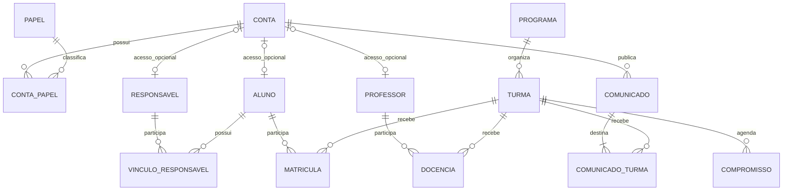
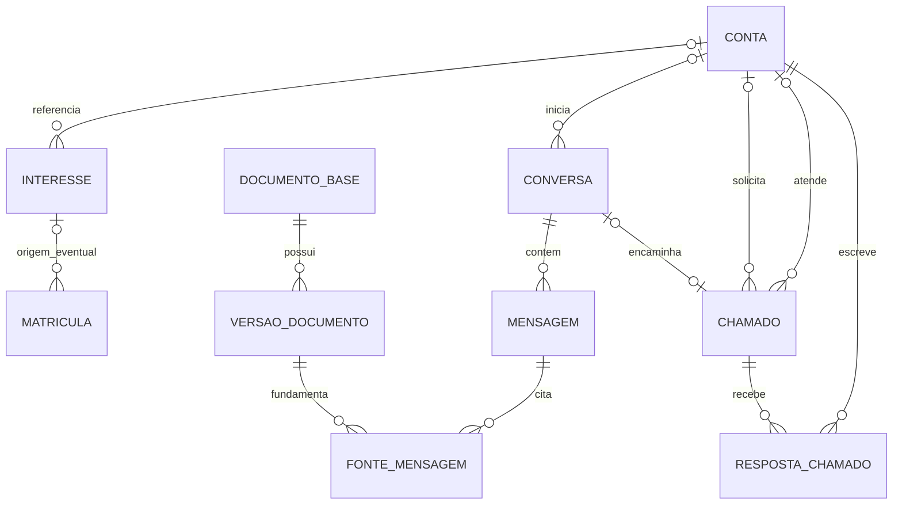
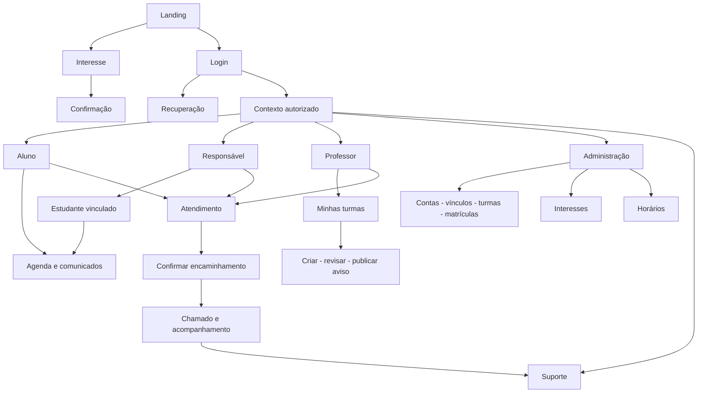

# Fase 1 — arquitetura da informação e modelo conceitual

Cortéx Instituto de Aprendizagem · arquitetando front e back end com wireframe de baixa fidelidade · 27/09/2026

Prazo da ação: até 30 dias a partir do início acordado 
Projeto completo: até 90 dias

[Protótipo Figma Make](https://www.figma.com/make/On6DHqjebObIzN21tfJVHO/)

Este documento registra hipóteses de produto, não funcionalidades de produção ou um esquema SQL executado. A landing tem texto provisório; oferta, modalidade, público exato e condições de inscrição ainda precisam ser confirmados. O README situa a iniciativa no ensino médio e capacitação de professores; não expandir para ensino fundamental sem decisão explícita.

## 1. Separação de conceitos

- Interesse: pedido para conhecer a proposta; não significa matrícula.
- Conta: identidade de acesso; pode possuir mais de um papel.
- Aluno: pessoa acompanhada, com conta opcional.
- Responsável: pessoa com vínculo verificado com um ou mais alunos.
- Matrícula: vínculo de aluno a turma, com estado e período.
- Docência: vínculo de professor a turma.
- Administrador e suporte: papéis da conta, com permissões delimitadas.
- IA: serviço de atendimento, sem conta administrativa e sem acesso irrestrito ao banco.

## 2. Entidades e cardinalidades

Relações muitos-para-muitos passam por entidades associativas. Conta opcional não implica aluno inexistente. Uma pessoa que seja professor e responsável pode usar uma conta com ambos os papéis. O modelo físico deve normalizar a identidade e detalhar exclusão, histórico e integridade.

### Dicionário e restrições propostas

| Entidade | Dados e regra principal |
|---|---|
| Conta | id, identificação de acesso, nome de exibição, estado |
| ContaPapel | conta_id + papel_id únicos |
| Aluno / Responsável / Professor | id, dados de domínio, conta_id opcional e único por entidade |
| VinculoResponsavel | responsável, aluno, tipo de relação, estado de verificação, validade |
| Programa | oferta educacional e estado; catálogo a confirmar |
| Turma | programa, nome, período, estado |
| Matricula | aluno, turma, início, término opcional, estado; impedir vínculo ativo duplicado no mesmo período |
| Docencia | professor, turma, período, estado |
| Compromisso | turma, título, início, fim, local; fim posterior ao início |
| Comunicado | autor, título, corpo, estado, data de publicação |
| ComunicadoTurma | comunicado + turma únicos; publicado exige ao menos um destinatário autorizado |
| Interesse | contato do interessado, canal, programa opcional, estado, origem; sem exigir dados completos da criança |
| Conversa | sessão pública ou conta, contexto, início e estado |
| Mensagem | conversa, autoria visitante/usuário/IA/atendente/sistema, conteúdo, data |
| Chamado | solicitante/contato, conversa opcional, assunto, atendente opcional, estado |
| RespostaChamado | chamado, autor autorizado, texto, data; histórico de respostas |
| DocumentoBase / VersaoDocumento | fonte, público permitido, versão, revisão e aprovação |
| FonteMensagem | mensagem e versão de documento; rastreabilidade da resposta |
| EventoAuditoria | ator, ação, recurso e data; não duplicar credenciais ou dados sensíveis no log |

### Atendimento e captação

As duas relações Conta–Chamado são campos distintos: solicitante e atendente. Chamado público exige sessão segura ou identificação verificável para consulta; apenas conhecer um número ou e-mail não autoriza acesso. IA só consulta dados privados por operações do servidor autorizadas para o solicitante.

## 3. Mapa público e interno

No protótipo, o seletor de perfis fica em um acesso explícito de DEMONSTRAÇÃO, separado do login. Na produção, contexto só lista perfis já autorizados.

## 4. Inventário de telas e CTAs

| Código | Tela | Ação principal / destino |
|---|---|---|
| P01 | Landing institucional | Quero me inscrever → P02; Já tenho cadastro → A01 |
| P02 | Interesse | Enviar interesse → P03; erros junto aos campos |
| P03 | Confirmação | Voltar à página inicial; informar que não é matrícula |
| A01 | Login | Entrar; recuperar acesso → A02 |
| A02 | Recuperação | Confirmar simulação / voltar |
| X01 | Seletor de perfis fictícios | Explorar fluxo; não concede autorização real |
| U01 | Início por perfil | Próxima tarefa, agenda e avisos |
| U02 | Agenda por dia | Abrir compromisso |
| U03 | Lista / detalhe do comunicado | Ler e voltar preservando contexto |
| R01 | Seletor de estudante | Alterar contexto vinculado |
| T01 | Minhas turmas | Consultar turma autorizada |
| T02 | Criar comunicado | Revisar → editar ou publicar → confirmar |
| D01 | Interesses administrativos | Abrir detalhe e atualizar estado demonstrativo |
| D02 | Pessoas, vínculos, turmas | Consultar modelo; gestão completa a detalhar |
| S01 | Atendimento simulado | Opções guiadas / falar com equipe |
| S02 | Encaminhamento | Revisar resumo e confirmar chamado |
| S03 | Fila e detalhe de chamado | Assumir, responder, encerrar |
| S04 | Acompanhamento | Ver status e resposta do próprio chamado |

## 5. Landing e responsividade

Ordem: cabeçalho → apresentação → proposta/metodologia → etapas → carrossel Acontece no Cortéx → FAQ → CTA final e rodapé.
O CTA de inscrição repete rótulo e destino. Mobile mantém Entrar fora do menu recolhido. Hero mobile apresenta texto e CTA antes do placeholder.
Carrossel sem autoplay, com arraste, botões e teclado. Modal fecha por Escape e devolve foco. Imagens informativas recebem descrição. Não colocar informações essenciais apenas no carrossel.
Agenda mobile é lista por dia. Desktop pode apresentar grade depois de validar as necessidades.
Mesmas tarefas nos dois formatos, sem hover obrigatório. Formulários mantêm dados após erro. Larguras de revisão: 360, 390, 768, 1024 e 1440 px.

## 6. Matriz de acesso conceitual

| Perfil | Leitura | Escrita |
|---|---|---|
| Visitante | público e própria sessão | interesse e mensagens próprias |
| Aluno | turmas com matrícula válida | atendimento e opções da própria conta |
| Responsável | informações permitidas dos vinculados verificados | atendimento próprio |
| Professor | turmas com docência válida | avisos dessas turmas |
| Admin | operação autorizada | cadastro, vínculos, horários, interesses |
| Suporte | fila autorizada e contexto necessário | respostas e estados de chamados |
| IA | fontes aprovadas e consultas autorizadas | respostas e pedido de encaminhamento |

Seletores e filtros do wireframe não são mecanismos de segurança. O servidor deverá validar papel + vínculo + recurso em cada operação. Responsável não recebe automaticamente conversas particulares do aluno; suporte não recebe todos os dados escolares.

## 7. Dados fictícios para testar relações

Lucas → 2º ano A; Bia → 2º ano B; Ana → responsável de Lucas e Bia; Marina → professora do 2º ano A.
Um aviso de Marina deve aparecer para Lucas e Ana/Lucas; não deve aparecer para Ana/Bia.
Esse conjunto valida a intenção de UX; não comprova autorização de produção.

## 8. Critérios de passagem para alta fidelidade

- [ ] Todos os CTAs essenciais têm destino e retorno.
- [ ] Contexto do estudante se mantém entre agenda e comunicados.
- [ ] Publicação de aviso e leitura pelos destinatários passam no roteiro.
- [ ] Encaminhamento, resposta do suporte e acompanhamento passam no roteiro.
- [ ] Mobile não esconde login nem sobrepõe controles essenciais.
- [ ] Erros, vazio, confirmação e sessão indisponível têm tratamento.
- [ ] Revisão com Henry/Eduardo e teste com representantes dos perfis registrados.
- [ ] Oferta e conteúdo público confirmados; placeholders identificados.
- [ ] Estado de baixa fidelidade preservado antes de aplicar alta.
- [ ] Base visual: azul #0A192F, ciano #00F0FF e superfícies claras, sujeita à revisão de contraste; não usar ciano como texto pequeno sobre branco.
- [ ] Alta fidelidade aplica tipografia, espaçamentos, componentes e imagens aos MESMOS fluxos, sem ampliar escopo.

Não incluir notas, pagamentos, frequência, contratos, diagnóstico pedagógico com IA ou matrícula completa nesta etapa.

## 9. Plano e indicadores

| Trabalho | Responsáveis | Prazo | Indicador |
|---|---|---|---|
| Modelo conceitual e mapa de telas | Henry e Eduardo | Fase 1 | Cada tarefa tem entidade, perfil, destino e retorno |
| Wireframe público | Henry e Eduardo | Primeira iteração | Inscrição e acesso navegáveis |
| Wireframe interno | Henry e Eduardo | Próxima iteração | Fluxos por perfil e relações demonstradas |
| Revisão de usabilidade | Henry e Eduardo | Dentro dos 30 dias | Contagem de tarefas concluídas sem ajuda, erros e facilidade percebida |
| Alta fidelidade | Henry e Eduardo | Após estabilizar fluxo | Mesmos caminhos preservados e componentes consistentes |

Meta de conclusão sem ajuda proposta: 85%, acompanhada de contagens por tarefa/perfil e limitações da amostra; não é resultado obtido.

## 10. Evidências e estado

A versão 3 do Make foi inspecionada em 27/09/2026. O histórico registra correção do botão Entrar mobile, nome acessível do menu e carrossel Flexbox/rodapé. Na sessão anterior foram percorridos interesse vazio, confirmação fictícia, login, recuperação e modal com Escape/retorno do foco.
A expansão interna V0.2 é escopo de trabalho; sua geração não significa validação. Evidências novas devem ser registradas em relatório separado.
Este commit versiona documentação; não contém exportação do código do Make nem implantação.
