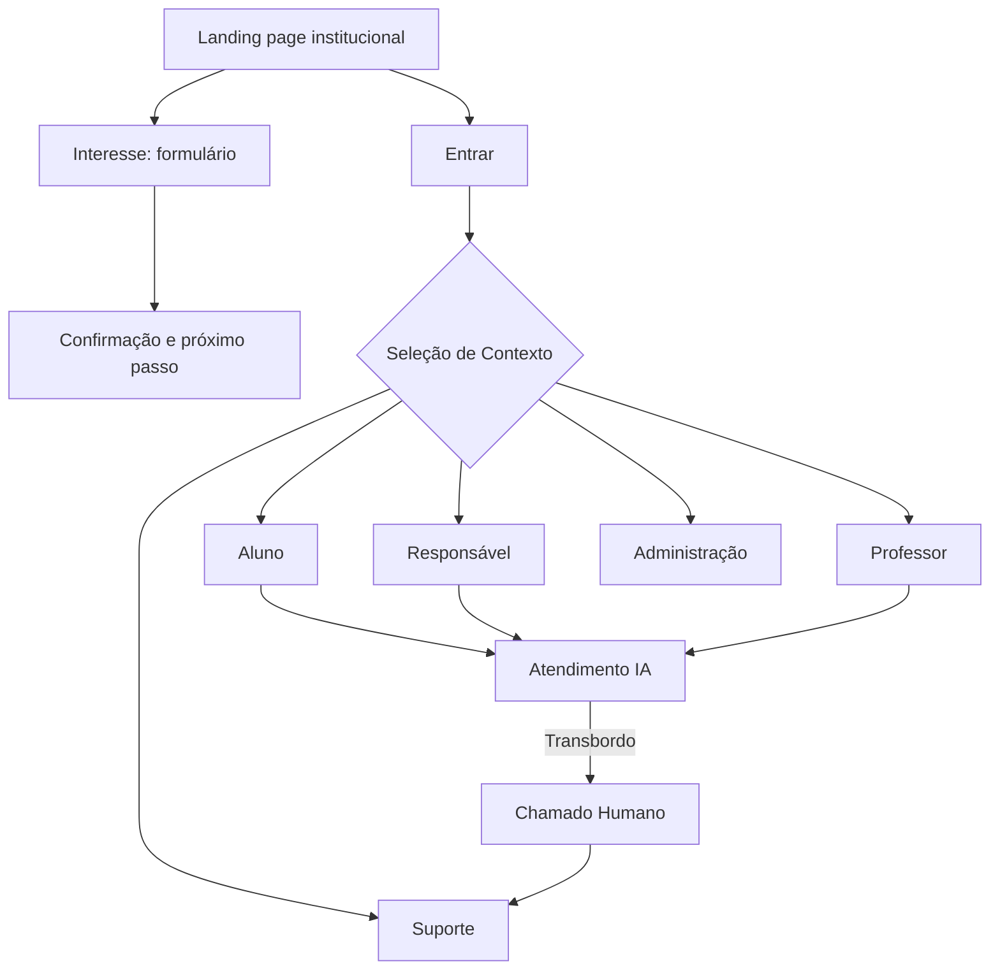
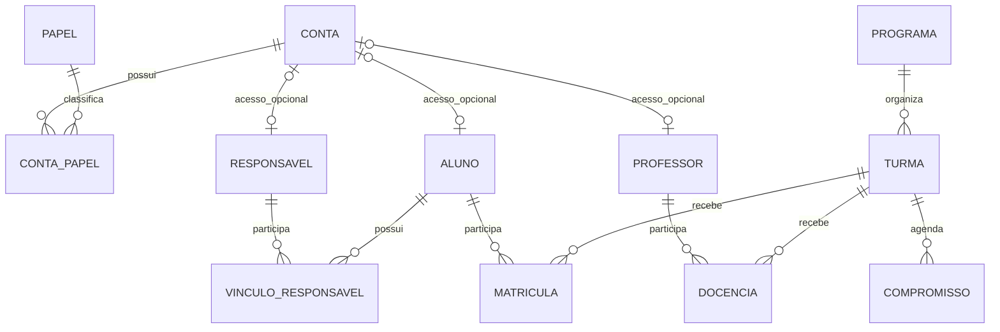

# 🧠 Cortéx Instituto de Aprendizagem

> **Uma iniciativa AI-FIRST para desenvolvimento e capacitação no Ensino Médio.**

Cortéx é uma plataforma educacional de alta performance que integra Inteligência Artificial como serviço central de atendimento e apoio. Este repositório reflete a **Fase 1 (Arquitetura da Informação e Modelo Conceitual)**, focada na estruturação de back-end e front-end de baixa fidelidade para MVP em até 90 dias.

🔗 [**Acessar Protótipo Figma Make**](https://www.figma.com/make/On6DHqjebObIzN21tfJVHO/?utm_source=gemini)

## 🏗️ Visão Geral da Arquitetura

O sistema foi desenhado com controle rigoroso de acesso (RBAC) isolando a IA de funções administrativas. O acesso ocorre via landing page institucional, conduzindo a um portal restrito dividido em 5 perfis de acesso unificados por uma única identidade de conta.

* **Perfis de Acesso:** Aluno, Responsável, Professor, Administrador e Suporte.

* **Motor de IA:** Atua exclusivamente como serviço de atendimento, fundamentado em bases de conhecimento aprovadas, sem acesso irrestrito ao banco de dados ou funções de gestão.

* **Design System (V0.1):** Superfícies claras com base institucional em Azul Escuro (`#0A192F`) e detalhes em Ciano (`#00F0FF`). Foco absoluto em contraste e acessibilidade.

## 🗺️ Mapa de Telas & Fluxo de Usuário

A navegação foi projetada para reduzir fricção, separando claramente o interesse público da área logada.

## 🗄️ Engenharia de Dados & Regras de Negócio

### Separação de Conceitos Core

* **Interesse vs Matrícula:** O preenchimento da LP gera apenas "Interesse". A matrícula é uma entidade separada.

* **Conta vs Perfil:** Uma "Conta" (autenticação) pode acumular múltiplos papéis (ex: um Professor que também é Responsável de um Aluno).

### Cardinalidade Principal

### Matriz de Acesso Conceitual

| **Perfil** | **Leitura Permitida** | **Escrita Permitida** |
| --- | --- | --- |
| **Visitante** | Conteúdo público e própria sessão | Formulário de interesse e chat visitante |
| **Aluno** | Turmas com matrícula válida | Atendimento e configurações da própria conta |
| **Responsável** | Dados permitidos dos dependentes vinculados | Atendimento próprio |
| **Professor** | Turmas com docência ativa | Avisos para essas turmas |
| **Admin** | Operações autorizadas no sistema | Gestão de cadastros, vínculos e matrículas |
| **IA** | Fontes aprovadas (RAG) | Respostas ao usuário e roteamento de chamados |

| **Código** | **Interface** | **Ação Principal** |
| --- | --- | --- |
| `P01-P03` | Páginas Públicas (LP) | Inscrição, apresentação da proposta |
| `A01-A03` | Autenticação | Login, recuperação, seletor de contexto |
| `U01-U05` | Rotina Diária (Usuários) | Dashboard, agenda, comunicados |
| `T01-T02` | Painel Docente | Gestão de turmas e criação de avisos |
| `D01` | Visão Administrativa | Identificação de pendências, matrículas |
| `S01-S04` | Atendimento & Suporte | Chat IA, fila de chamados, resolução |

## 🎯 Critérios de Aceite para Alta Fidelidade

Para que uma tela seja promovida para alta fidelidade, ela deve obrigatoriamente cumprir:

* [ ] Revisão completa dos CTAs essenciais e rotas de retorno; principais fluxos mapeados.
* [x] O contexto do estudante se mantém estável ao transitar entre agenda e comunicados.
* [x] Criação de avisos e filtro por turma percorridos no protótipo; não é teste de permissão no servidor.
* [ ] Revisão completa de responsividade: landing, revisão de comunicado e acompanhamento medidos em cinco larguras sem overflow; demais telas e dispositivos ainda pendentes.
* [ ] Auditoria completa dos estados de interface; erros, vazio e confirmação presentes em fluxos específicos, sem comprovação de cobertura total.

Evidências e limites: [validação local de 28/09](validacao-2026-09-28.md). Backend e RBAC são arquitetura proposta, não controle implementado nesta versão. Paleta azul/ciano é referência futura; o protótipo continua em cinzas.

*Documentação técnica elaborada por Henry e Eduardo. Notas, pagamentos e diagnósticos pedagógicos automatizados estão intencionalmente fora do escopo deste MVP.*
