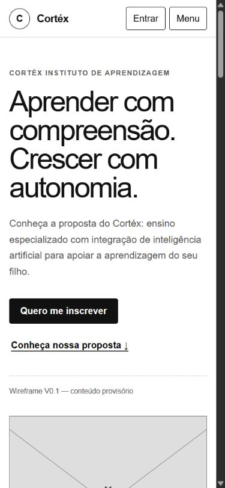
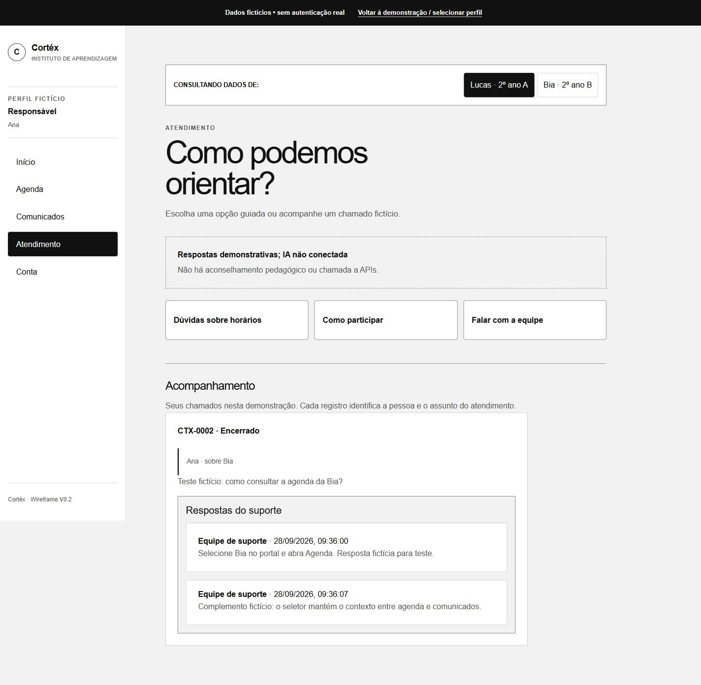

# Validação local — 28/09/2026

Responsáveis pelo projeto: Henry e Eduardo. Execução técnica desta rodada: Codex, por solicitação de Henry.

## Entrega desta rodada

Exportação do Figma Make incorporada em `frontend/`, com React, TypeScript, Vite e Tailwind. Configuração independente do Make. Baixa fidelidade preservada. Original em Downloads não alterado.

Correções:

1. Respostas passam a formar histórico com autoria e data, sem substituir respostas anteriores.
2. Encerramento exige revisão; é possível voltar ao atendimento. Rascunho não enviado é sinalizado antes do descarte.
3. Rascunho e mensagens de validação são limpos na troca de chamado.
4. Troca do estudante reinicia o formulário de encaminhamento para não reaproveitar resumo sob outro contexto. Histórico continua pertencendo ao solicitante, com contexto explícito em cada chamado.
5. Navegação mobile com botões de pelo menos 44 px de altura; quebra de textos longos no atendimento.
6. Conteúdo do antigo `readme.md` preservado em `docs/guia-repositorio.md`, resolvendo colisão de nomes no Windows.

## Evidência executada

Ambiente: Windows, Chrome, servidor Vite local. Dados fictícios. Testes de interação pelo navegador, não testes com participantes.

| Caso | Procedimento e resultado observado |
|---|---|
| Build | `pnpm build`: TypeScript e Vite concluídos sem erros |
| Interesse | Envio vazio mostrou erros; nome fictício e teste@example.com levaram à confirmação sem envio real |
| Menu mobile | Abriu e fechou; Entrar permaneceu visível fora do menu |
| Modal | Abriu; Escape fechou; foco retornou a Ver detalhes |
| Encaminhamento | Ana/Bia: resumo vazio bloqueado; revisão identificou Bia; confirmação criou CTX-0002 |
| Fila | CTX-0002 apareceu para suporte com Ana/Bia |
| Respostas | Assumir mudou para Em atendimento; resposta vazia bloqueada; duas respostas preservadas no histórico |
| Encerramento | Voltar na revisão manteve atendimento; confirmar exibiu Encerrado e retirou formulário de resposta |
| Acompanhamento | Ana viu CTX-0002 encerrado e as duas respostas; Lucas viu apenas seu CTX-0001 |
| Rascunho | Digitado em CTX-0001, saída para outro chamado e retorno: campo vazio |
| Comunicado | Campos vazios mostraram erros; revisão e volta preservaram título; publicação criou aviso para 2º A |
| Destinatários | Ana/Lucas viu o aviso novo; Ana/Bia viu apenas comunicado de 2º B |
| Contexto | Após selecionar Bia e abrir Agenda, permaneceu 2º B |
| Console | Nenhum erro capturado na consulta final dos logs da aba |

## Responsividade

Medição do documento em 360, 390, 768, 1024 e 1440 px: **sem overflow horizontal da página** nas telas landing, revisão de comunicado e acompanhamento. Carrossel mantém rolagem própria.

Inspeção visual da landing mobile (390 px), acompanhamento mobile e atendimento desktop. Isso não equivale à revisão de todas as telas em todos os dispositivos, nem à auditoria completa de acessibilidade.

## Como repetir os fluxos críticos

1. Entrar → Explorar portal → Responsável → Bia → Atendimento → Falar com a equipe. Revisar um resumo fictício e confirmar.
2. Selecionar perfil → Suporte → abrir CTX-0002 → assumir → responder duas vezes → encerrar → revisar → confirmar.
3. Selecionar Responsável → Atendimento: verificar as duas respostas e status. Selecionar Aluno: CTX-0002 não deve aparecer.
4. Professor → Criar comunicado: preencher, revisar, voltar, revisar e publicar. Responsável → Comunicados: verificar Lucas e Bia; abrir Agenda e verificar preservação da seleção.

## Pendências da fase 1

- Revisão com Henry/Eduardo e representantes dos perfis; meta proposta de 85% de tarefas sem ajuda ainda não foi medida.
- Confirmar oferta, público, modalidade, condições de inscrição e conteúdo definitivo da landing.
- Auditoria de teclado, leitores de tela e foco entre todas as telas; verificar navegadores/dispositivos reais e textos extremos.
- Ampliar revisão da administração, recuperação de acesso e demais estados não percorridos nesta rodada.
- Extrair componentes e regras de domínio conforme a próxima expansão; App.tsx ainda concentra o protótipo exportado.
- Preservar referência de baixa fidelidade e aprovar seus fluxos antes da alta fidelidade.

Não há backend, segurança de produção, IA real ou deploy público. Os filtros demonstram intenção de UX, não autorização. Não há teste de vazamento de permissão no servidor porque esse servidor ainda não existe.

## Responsável, prazo e indicador

| Ação | Responsável | Prazo | Indicador |
|---|---|---|---|
| Migração local e atendimento | Henry/Eduardo, apoio Codex | Rodada de 28/09: executada | Build aprovado e ciclo de chamado percorrido |
| Revisão com usuários | Henry e Eduardo | Dentro dos 30 dias da fase 1, início a confirmar | Contagem de tarefas sem ajuda, erros e facilidade por perfil |
| Preparação de alta fidelidade | Henry e Eduardo | Após revisão da baixa | Fluxos estabilizados, conteúdo confirmado e decisões visuais registradas |
